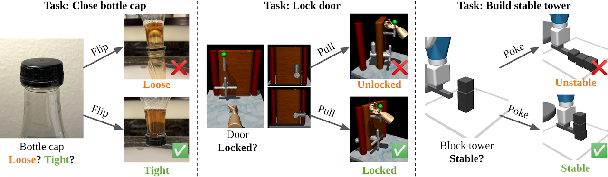

# Training Robots to Evaluate Robots: Example-Based Interactive Reward Functions for Policy Learning

CoRL 2022 (Oral)\
[Kun Huang](https://www.linkedin.com/in/kun-huang-620034171/), [Edward S. Hu](https://edwardshu.com/), [Dinesh Jayaraman](https://www.seas.upenn.edu/~dineshj/)
#### [[Paper (Openreview)]](https://openreview.net/forum?id=sK2aWU7X9b8) [[Project Website]](https://sites.google.com/view/lirf-corl-2022/)

<a href="https://sites.google.com/view/lirf-corl-2022/">
<p align="center">

</p>
</img></a>

Physical interactions can often help reveal information that is not readily apparent. For example, we may tug at a table leg to evaluate whether it is built well, or turn a water bottle upside down to check that it is watertight. We propose to train robots to acquire such interactive behaviors automatically, for the purpose of evaluating the result of an attempted robotic skill execution. These evaluations in turn serve as "interactive reward functions" (IRFs) for training reinforcement learning policies to perform the target skill, such as screwing the table leg tightly. In addition, even after task policies are fully trained, IRFs can serve as verification mechanisms that improve online task execution. For any given task, our IRFs can be conveniently trained using only examples of successful outcomes, and no further specification is needed to train the task policy thereafter. In our evaluations on door locking and weighted block stacking in simulation, and screw tightening on a real robot, IRFs enable large performance improvements, even outperforming baselines with access to demonstrations or carefully engineered rewards.

If you find this work useful in your research, please cite:
```
@inproceedings{
huang2022training,
  title={Training Robots to Evaluate Robots: Example-Based Interactive Reward Functions for Policy Learning},
  author={Kun Huang and Edward S. Hu and Dinesh Jayaraman},
  booktitle={6th Annual Conference on Robot Learning},
  year={2022},
  url={https://openreview.net/forum?id=sK2aWU7X9b8}
}
```


## Install Python Environment

### Roboaware

1. Run `conda env create -f environment.yml`, then activate this conda environment.
2. Clone the [`d4rl`](https://github.com/voyager1998/d4rl.git)
3. cd into the d4rl repo, run `pip install -e .`

### ROBEL

WARNING: Do not install robel package inside `Roboaware` conda env, it's incompatible.

1. Clone [ROBEL](https://github.com/voyager1998/robel.git) repo into another folder.
2. Run `pip install -e .` inside robel.
3. For the rest, follow exactly the [instructions](https://github.com/google-research/robel). May need to download MuJoCo 2.0 if not installed, but it's fine to have multiple versions of MoJoCo.
4. Use Dynamixel Wizard to figure out the port etc of the motors.
5. After modifying ROBEL code, reinstall robel by running

```bash
pip uninstall robel
pip install -e .
```

## Trouble Shooting

If the error `Failed to initialize OpenGL` appears, refer to [link](https://github.com/openai/mujoco-py/issues/187), and try `unset LD_PRELOAD`.

If the error `GLEW initialization error: Missing GL version` appears, refer to [link](https://github.com/openai/mujoco-py/issues/408), and try

```bash
export LD_PRELOAD=/usr/lib/x86_64-linux-gnu/libGLEW.so
```
